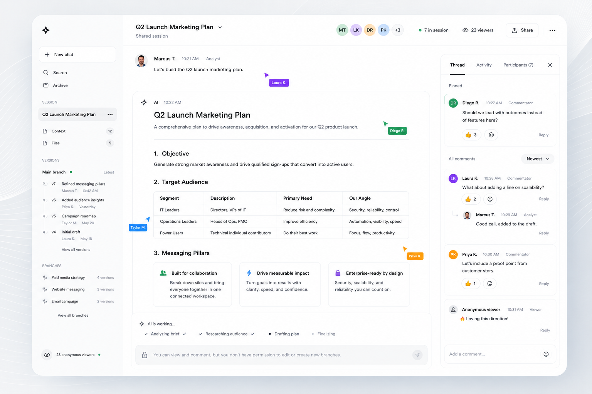

# Design Reference

This folder contains Labrador's design direction and visual reference material.

## Original System Design

The starting visual reference is stored at:

Agents implementing the frontend MUST treat this image as directional product intent, not
as a pixel-perfect final spec.

## What To Preserve

The reference establishes:

- A shared session as the first screen.
- Left navigation for session context, files, versions, and branches.
- Main work area for AI output and prompt artifacts.
- Right collaboration panel for comments, activity, and participants.
- Visible collaborator presence.
- Anonymous viewer counts.
- Permission-aware composer state.
- AI run progress at the bottom of the work area.
- Light, focused, professional work-surface styling.

## What May Change

Agents MAY adapt:

- Exact spacing, borders, and typography.
- Mobile layout.
- Sidebar density.
- Comment card structure.
- Prompt/output rendering.
- Icon choices.

Agents MUST NOT adapt away the core product model: shared AI work with presence,
comments, versions, branches, share links, permissions, and visible run state.

## Mobile Interpretation

On mobile, the same content model MUST survive in a narrower shape:

- Main work first.
- Comments/activity/participants behind tabs or sheets.
- Share and permission state accessible.
- Run status visible during streaming.
- Anonymous/authenticated status understandable.

